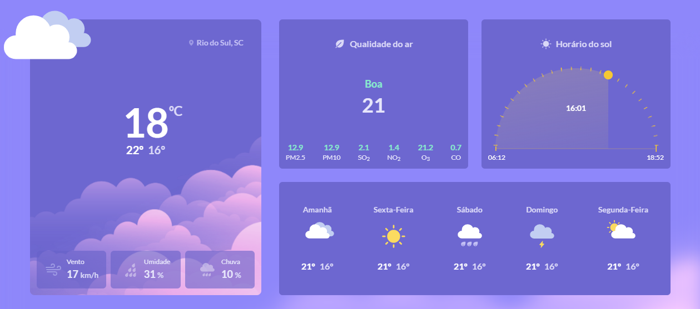

<h1 align="center">🚀Desafio 10 do projeto #boracodar da Rocktseat🚀</h1>

Este projeto consiste em desenvolver um layout responsivo de uma página de clima conforme o modelo do [Figma](https://www.figma.com/community/file/1215291914714743267)

<h2> Deploy </h2>

[Clique aqui](https://bora-codar-desafio10.vercel.app) para abrir.

<h2>👩‍💻 Tecnologias</h2>
  
  
  
  
  

<h2>📱 Projeto</h2>

Agradecimento ao [Wilian Silva](https://github.com/Wilian-N-Silva) por ter contribuído para fazer o gráfico do Hoário do Sol que, sem dúvidas, foi o maior desafio desse projeto.

  

